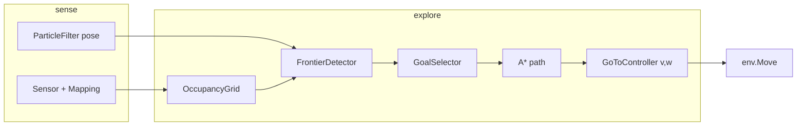

# План: исследование карты в симуляторе (`scripts/sim`)

Цель: доработать симулятор (`test.py`, `GridMap`, `ParticleFilter`) до автономного режима **исследования** — движение к неизведанным областям по строящейся карте, без ручного управления `w/a/s/d`.

Связанные документы:

- [SLAM_ROADMAP.md §6.2](./SLAM_ROADMAP.md#62-исследование-пространства-exploration) — exploration на роботе (frontier, nav_goal)
- [SYSTEM_DESIGN.md](./SYSTEM_DESIGN.md) — общая архитектура

---

## Текущее состояние

| Есть | Нет |
|------|-----|
| Occupancy grid (log-odds), `GetGridProb` ≈ 0.5 = unknown | Классификация ячеек free / occ / unknown |
| Построение карты лидаром (`SensorMapping`) | Frontier detection |
| Модель движения `(v, ω)`, PF | Планировщик пути, контроллер «ехать к точке» |
| Ручное управление в `test.py` | `explore_map()`, конечный автомат миссии |

---

## Целевая архитектура



### Публичный API (цель)

```python
explorer = MapExplorer(gmap, bot_param, pose_fn)
control = explorer.step()       # один тик: (v, w) или None
done = explorer.is_complete()   # нет frontier / застрял
```

В `test.py`: клавиша `e` — вкл/выкл режима исследования; в цикле при активном режиме вызывать `explorer.step()` вместо клавиш.

---

## Этап 0 — подготовка (0.5–1 день)

| Задача | Зачем |
|--------|--------|
| Вынести цикл из `test.py` в `SimSession` / `run_step(control)` | Один шаг: Move → Sensor → Mapping → PF → отрисовка |
| Единый **pose для навигации**: `pf.particle_list[argmax].pos` (не `env.bot_pos`) | Исследование по оценке PF, не по ground truth |
| Пороги карты: `P_FREE < 0.35`, `P_OCC > 0.65`, иначе `UNKNOWN` | Явная тройка состояний |
| `GridMap.is_unknown/free/occupied(ix, iy)` | Упростит frontier и A* |

**Критерий готовности:** на карте визуально различаются unknown / free / occupied.

---

## Этап 1 — карта для планирования (1–2 дня)

**Файл:** `scripts/sim/occupancy_grid.py`

- `build_occupancy(gmap, bounds) → np.ndarray` (uint8: 0 unknown, 1 free, 2 occ)
- Инфляция препятствий на 1–2 клетки (`gsize`) — учёт диаметра робота
- Кэш с инвалидацией при `SensorMapping`

**Критерий:** overlay на `AdaptiveGetMap` — видна граница unknown/free.

---

## Этап 2 — Frontier + выбор цели (1–2 дня)

**Файл:** `scripts/sim/frontier.py`

**Определение:** frontier cell = `free`, у которой есть сосед (4 или 8) `unknown`.

**Кластеризация:** connected components → список целей `(cx, cy)` в мировых координатах.

**`select_explore_goal(pose, clusters)`:**

- v1: nearest frontier (евклидово расстояние)
- v2 (позже): utility = `info_gain / (dist + ε)`

**`explore_map(gmap, pose, bot_param) → goal_xy | None`**

- `None` — исследование завершено (нет frontier)

**Критерий:** при ручном движении цель прыгает к ближайшей «дыре»; на экране — красная точка цели.

---

## Этап 3 — локальный планировщик (2–3 дня)

**Файл:** `scripts/sim/planner.py`

- **A\*** на grid (только free), эвристика Manhattan
- Старт/финиш: grid-индексы из `pose` и `goal`
- Если цель в unknown — ближайшая достижимая frontier-клетка на границе free
- Fallback: следующий кластер frontier, если путь не найден

**Выход:** `path = [(x0, y0), (x1, y1), ...]` в мировых координатах.

**Критерий:** путь не проходит через occ; зелёная ломаная на окне `map`.

---

## Этап 4 — контроллер «ехать к точке» (1–2 дня)

**Файл:** `scripts/sim/goto_controller.py`

Из `path` и `pose`:

1. Lookahead waypoint (1–3 м вперёд по пути)
2. `bearing = atan2(dy, dx) − θ` → `ω` (P-регулятор, `±ω_max`)
3. Если `|bearing| < threshold` → `v = v_max`, иначе `v = 0` (или малый `v`)
4. Достижение цели → replan / следующий frontier

**Критерий:** промежуточный тест «клик по карте → робот едет» до полного explore.

---

## Этап 5 — `MapExplorer` и `explore_map()` (1 день)

**Файл:** `scripts/sim/explorer.py`

```
Состояния: IDLE | PLAN | FOLLOW | REPLAN | STUCK | DONE

step():
  - обновить occupancy (если карта изменилась)
  - нет path / цель устарела → select_explore_goal + A*
  - иначе goto_controller → (v, w)
  - STUCK: N тиков без сдвига pose → blacklist cluster, REPLAN
  - DONE: нет frontier
```

**Параметры (стартовые):**

| Параметр | Значение |
|----------|----------|
| `replan_period` | каждые 10–20 шагов или при смене frontier |
| `stuck_threshold` | 15 тиков, смещение < 2 px |
| `min_frontier_size` | 3 клетки |

**Критерий:** `e` в UI — робот сам доезжает к неизвестной зоне, карта растёт.

---

## Этап 6 — `test.py` и визуализация (0.5–1 день)

| Клавиша | Действие |
|---------|----------|
| `e` | toggle explore |
| `p` | pause explore |

На окне `map`:

- frontier — голубой
- goal — красный
- path — зелёный
- pose PF — жёлтый

Статус: `Explore: PLANNING / MOVING / DONE / STUCK`.

**Структура каталога:**

```
scripts/sim/
  test.py
  explorer.py
  frontier.py
  planner.py
  goto_controller.py
  occupancy_grid.py
  GridMap.py
  ParticleFilter.py
  SingleBotLaser2D.py
  utils.py
```

---

## Этап 7 — качество и SLAM (опционально, 2–4 дня)

| Улучшение | Эффект |
|-----------|--------|
| Replan при расхождении PF / одометрии | Меньше езды по устаревшей карте |
| `Mapping` в частицах при resample | Карта PF ближе к «реальной» |
| Scan matching / ICP | Точнее pose → лучше frontier |
| Сравнение с `env.bot_pos` | Метрики: % unknown, длина пути |
| Лог сессии в файл | Воспроизведение |

---

## Отложено (вне scope симулятора)

- **Coverage / уборка** (boustrophedon) — отдельная миссия, см. [SLAM_ROADMAP §6.3](./SLAM_ROADMAP.md#63-покрытие-всей-свободной-области-coverage-path-planning)
- **ROS / navigation_node** на роботе
- **D\* / RRT** — для sim достаточно A* на grid

---

## Итерации и оценка сроков

| # | Deliverable | Проверка |
|---|-------------|----------|
| 0 | Рефакторинг цикла + пороги OCC | 3 класса ячеек |
| 1 | `OccupancyGrid` | overlay unknown/free/occ |
| 2 | `find_frontiers` + `select_explore_goal` | цель на карте |
| 3 | A* | путь до цели |
| 4 | `GoToController` | едет к цели |
| 5 | `MapExplorer.step()` + `explore_map()` | автономно по `e` |
| 6 | UI + статусы | отладка |
| 7 | PF mapping, метрики | большая карта |

**MVP (этапы 0–5):** ~1–1.5 недели part-time.
**С этапом 7:** +1 неделя.

---

## Контракт функций

### `explore_map`

```python
def explore_map(
    gmap: GridMap,
    pose: np.ndarray,  # [x, y, theta_deg]
    bot_param: list,
    *,
    replan: bool = False,
) -> tuple[tuple[float, float] | None, list[tuple[float, float]]]:
    """
    Returns:
        goal_xy — цель исследования или None если карта исследована
        path — полилиния в мировых координатах (может быть пустой)
    """
```

### `explore_control`

```python
def explore_control(
    pose: np.ndarray,
    path: list[tuple[float, float]],
    bot_param: list,
) -> tuple[float, float]:
    """(v, w) на один тик симуляции."""
```

---

## Рекомендуемый порядок старта

1. Этапы **0 → 2** (карта + frontier + визуализация цели) — быстрый feedback без планировщика.
2. Этапы **3 → 4** (A* + goto) — езда к выбранной цели.
3. Этап **5** — сборка в `MapExplorer` и режим `e` в `test.py`.
