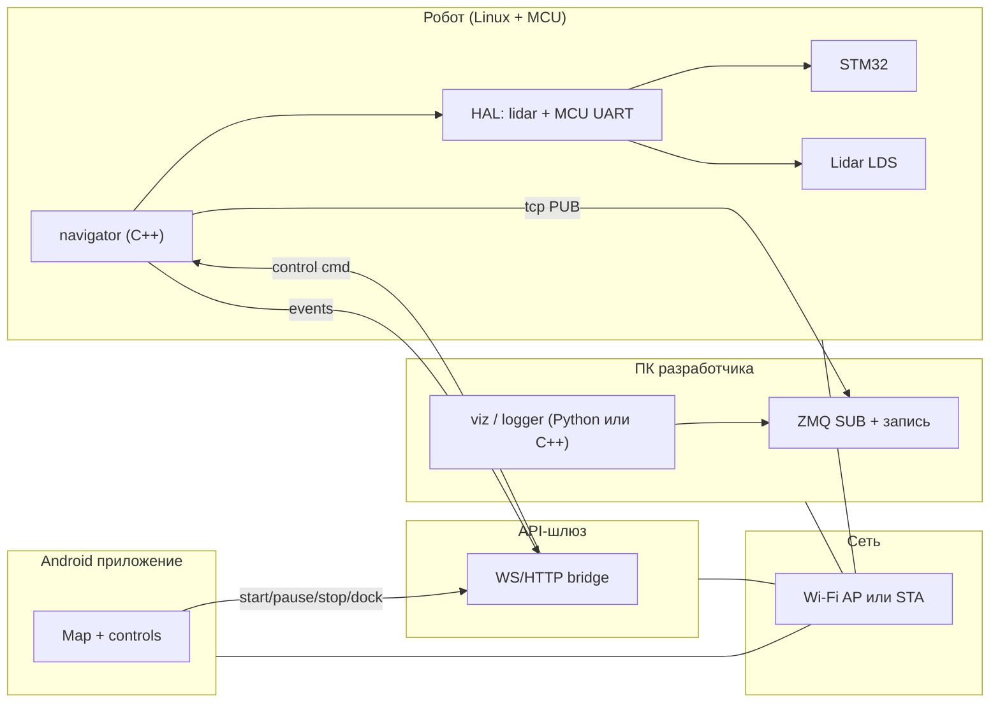
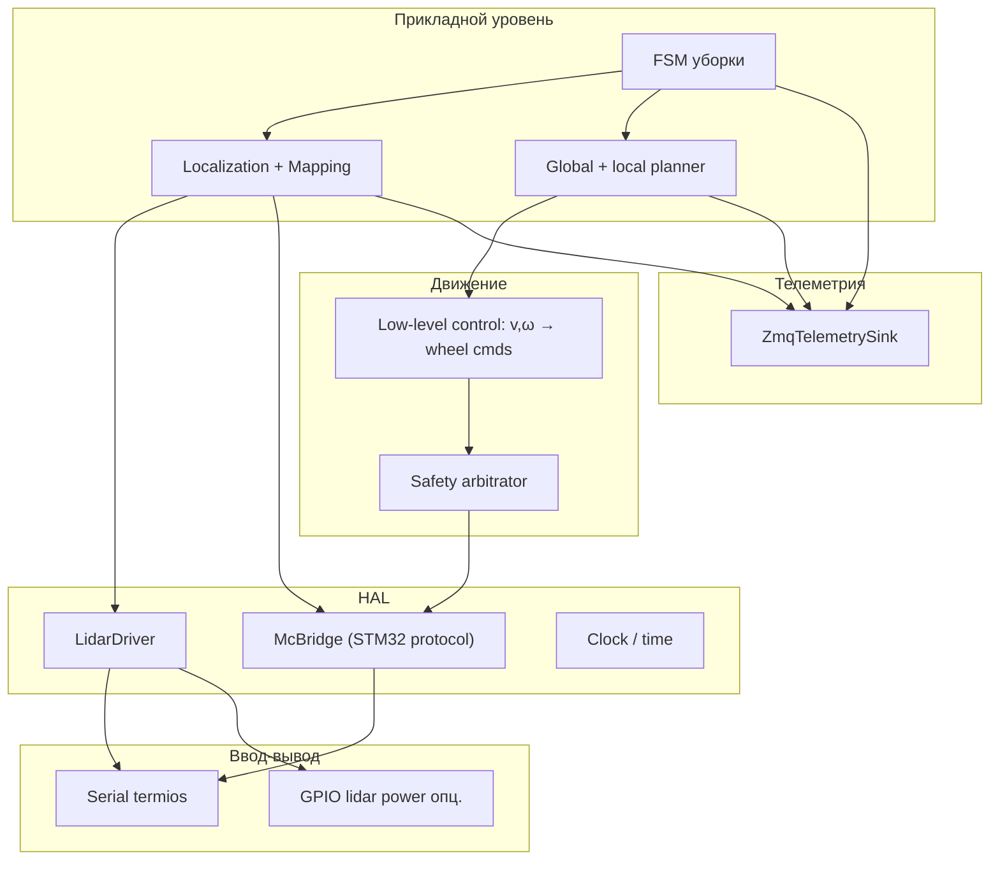
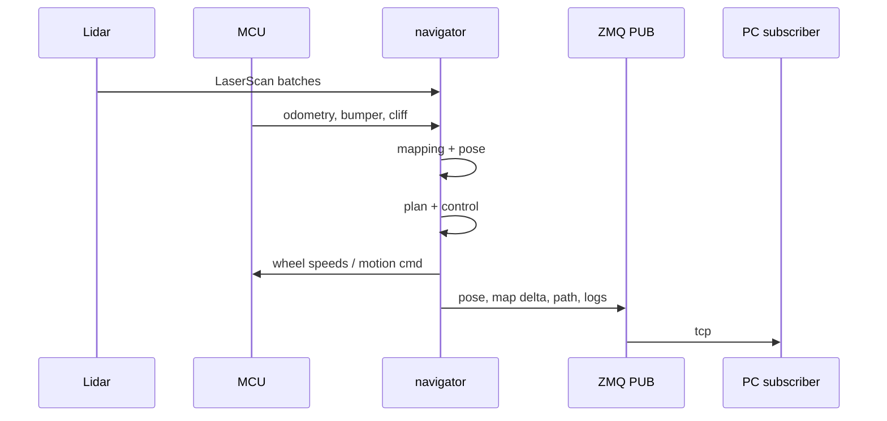
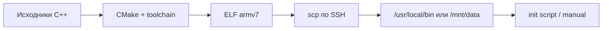

# System design: стек навигации и уборки (Xiaomi Mi Robot Vacuum gen1)

Документ фиксирует **архитектуру системы**: границы компонентов, потоки данных, интерфейсы и развёртывание. Детальный поэтапный план работ — в [PLAN.md](./PLAN.md) (инвентаризация и разбор штатного стека — [§3.1–3.2](./PLAN.md#31-результаты-инвентаризации-снято-по-ssh-апрель-2026)); прошивка и SSH — в [BURN.md](./BURN.md).

**Целевая платформа:** `rockrobo.vacuum.v1` (ruby), Linux на **Allwinner R16**, низкий уровень — **STM32F103** по UART.

---

## 1. Цели и нефункциональные требования

| Требование | Описание |
|------------|----------|
| Функциональность | Построение 2D-карты, планирование покрытия и обход препятствий, управление колёсами, чтение лидара и сенсоров через HAL; полноценный цикл уборки как в проде |
| Развёртывание | Один (или несколько согласованных) **C++** бинарника на роботе; сборка на ПК, доставка по **SSH** |
| Наблюдаемость | Поток телеметрии на ПК: карта, путь, логи; **запись** сессий для офлайн-анализа |
| Мобильный UX | Android-приложение показывает карту/статус и отправляет команды уборки (start/pause/stop/dock) |
| Связь | Либо **Wi‑Fi AP** на роботе, либо робот в домашней сети; транспорт телеметрии — **ZeroMQ** (см. [PLAN.md §12](./PLAN.md)) |
| Безопасность | Сторожевой таймер на стоп моторов; приоритет **cliff / bumper** над планом; ограничение скорости на ранних этапах |
| Ограничения | ~**512 MiB** RAM, старый **glibc**/ядро; без тяжёлых зависимостей в горячем пути |

---

## 2. Контекст системы

---

## 3. Логическая архитектура (слои)

Сверху вниз — зависимости только «вниз», чтобы HAL и транспорт можно было мокать на ПК.

**Принципы:**

- **Safety arbitrator** — единственное место, где команды движения могут быть обнулены по cliff/bumper/таймауту лидара.
- **FSM** не ходит в UART напрямую; только через HAL и планировщик.
- **ZmqTelemetrySink** не блокирует цикл управления: неблокирующая очередь или отправка в отдельном потоке с дропом при переполнении (карта — редко, поза — чаще).

---

## 4. Физическое представление и процессы

| Узел | Процессы | Примечание |
|------|-----------|------------|
| Робот | `navigator` (основной), опционально `hostapd`+`dnsmasq` для AP | Штатные `miio`/`player` **остановлены** в режиме своего стека или не используют те же UART |
| ПК | `telemetry_logger`, `map_viz` | Подписчики **ZMQ SUB**; запись на диск |

### 4.1. Штатное ПО до замены: Player в `/opt/rockrobo/cleaner`

Пока на роботе работает заводская/типовая навигация Roborock, основной потребитель железа — не наш `navigator`, а процесс **`player`**:

- Запуск: типично `player /opt/rockrobo/cleaner/conf/ruby_chassis.cfg`.
- Конфиг **`ruby_chassis.cfg`** описывает цепочку **драйверов Player** с полями `plugin "lib….so"`, `provides` / `requires` (граф зависимостей).
- Бинарники: **`/opt/rockrobo/cleaner/bin/player`** и соседи (`AppProxy`, `RoboController`, …); библиотеки драйверов — **`/opt/rockrobo/cleaner/lib/`** (`libchassisdriver.so`, `librubylaserdriver.so`, `librrslamdrv.so`, `libNavDriver.so`, `libuart_api.so`, набор `libplayer*.so`).
- **Лидар:** драйвер `ruby_laser` в cfg задаёт **`port "/dev/ttyS1"`** (подтверждено на **3.5.8_004028**, см. [PLAN.md §3.2](./PLAN.md#32-штатный-стек-optrockrobocleaner-player)).
- **MCU / шасси:** драйвер `ruby_chassis` (`libchassisdriver`); на практике **`player`** также открывает **`/dev/ttyS2`** (эксклюзивная запись — см. [PLAN.md §3.1](./PLAN.md#31-результаты-инвентаризации-снято-по-ssh-апрель-2026)).
- **SLAM:** `rrslam` (`librrslamdrv`), карты и таймауты — см. **`Nav.cfg`**, **`slam_info.cfg`** в том же `conf/`.

Имеет смысл рассматривать этот стек как **референс по топологии сенсоров** и как **конкурента за UART**: перед тестами HAL порт нужно освободить (скрипты в [`app/scripts/`](../app/scripts/)).

**Потоки внутри `navigator` (рекомендация):**

1. **Главный цикл управления** (фиксированный период, например 20–50 ms): чтение состояния MCU → обновление одометрии → при необходимости прочитать/синхронизировать лидар → локализация/карта (часть шагов реже) → планировщик → команда моторам.
2. **Поток лидара** (если чтение блокирующее): сбор сканов в lock-free буфер; главный цикл забирает «последний полный скан».
3. **Поток ZMQ** (опционально): drain очереди исходящих сообщений.

---

## 5. Потоки данных (упрощённо)

---

## 6. Внешние интерфейсы

### 6.1. Железо (робот)

| Интерфейс | Назначение | Примечание |
|-----------|------------|------------|
| **`/dev/ttyS1`** | Лидар **115200 8N1**, бинарный протокол Delta‑2D | В штатном cfg — порт драйвера `ruby_laser`; эксклюзивное открытие |
| **`/dev/ttyS2`** | Протокол **Linux ↔ STM32** (шасси) | Удерживается `player` вместе с `ttyS1`; см. [PLAN.md §3.1](./PLAN.md#31-результаты-инвентаризации-снято-по-ssh-апрель-2026) |
| GPIO (опц.) | Питание/старт мотора лидара | По результатам инвентаризации |

### 6.2. Сеть

| Режим | Назначение |
|-------|------------|
| AP | Лаборатория: ПК подключается к роботу, фиксированный IP робота |
| STA | Дом: робот в Wi‑Fi, телеметрия на IP ПК из конфига |

### 6.3. ZeroMQ

| Направление | Паттерн | Назначение |
|-------------|---------|------------|
| Робот → ПК | **PUB** (`tcp://0.0.0.0:PORT`) | Телеметрия: скан (подвыборка), поза, дельты карты, полилиния пути, лог-строки |
| ПК → Робот | **PUSH** на `tcp://robot:PORT` или **REQ/REP** | Команды высокого уровня (старт/стоп, параметры) — по необходимости |

**Соглашение о сообщениях:** первый кадр multipart — **топик** (строка UTF-8), далее — **бинарный блок** с версионированным заголовком + полезная нагрузка (например **msgpack**). Это упрощает фильтрацию на ПК без общего «мультиплексора».

Рекомендуемые топики (черновик):

- `scan` — подвыборка лучей или сжатый скан
- `pose` — `t, x, y, theta`
- `map` — дельта или downsampled grid
- `path` — waypoints в мире карты
- `log` — уровень + текст
- `fsm` — состояние автомата

---

### 6.4. API для Android

| Направление | Протокол | Назначение |
|-------------|----------|------------|
| Android → API-шлюз | HTTP/WS | Команды `start`, `pause`, `stop`, `dock`, запрос текущего статуса |
| API-шлюз → Android | WebSocket stream | События карты/позы/статуса уборки в UI-формате |

**Замечание:** API-шлюз конвертирует внутренние сообщения навигации в мобильный контракт версий `v1`, чтобы Android-клиент не зависел от внутренних изменений HAL/SLAM.

---

## 7. Модель данных (ядро)

Структуры держать в общем заголовочном пространстве `types/`, сериализация для ZMQ — отдельный слой `telemetry/encode.hpp`.

| Сущность | Поля (минимум) |
|----------|----------------|
| `LaserScan` | `stamp`, углы/дальности или пары `(bearing, range)` |
| `Odometry` | `stamp`, `x, y, theta`, опционально ковариация |
| `OccupancyGrid` | разрешение, origin, `width`, `height`, ячейки или RLE/дельты |
| `Path` | упорядоченный список `(x, y)` |
| `SafetyStatus` | битовые флаги cliff/bumper, причина стопа |

---

## 8. Конфигурация

Один файл (например **YAML** или простой **INI**), путь через аргумент CLI или переменную окружения:

- порты UART и скорости;
- порты ZMQ и bind/connect;
- лимиты скорости/ускорения;
- частоты публикации телеметрии;
- параметры сетки карты и планировщика.

На роботе конфиг кладётся рядом с бинарником или в `/mnt/data/...` при нехватке места в root.

---

## 9. Сборка и развёртывание

- **Тулчейн:** совместимый с **glibc** робота или **статическая musl** сборка — см. [PLAN.md §6](./PLAN.md).
- **Зависимости:** **libzmq** (+ при необходимости **libsodium**) — либо статика, либо упаковка `.so` на робота.
- **Версионирование:** в телеметрии и в логе при старте печатать **git hash** и версию схемы сообщений.

---

## 10. Отказоустойчивость и безопасность

| Ситуация | Поведение |
|----------|-----------|
| Нет данных лидара N ms | Удержание или замедление; по порогу — **SAFE_STOP** |
| Потеря связи MCU / CRC ошибки | Стоп моторов, переход в **ERROR** |
| Переполнение очереди ZMQ | Дроп низкоприоритетных кадров (`map`), сохранение `pose`/`log` |
| Команда «стоп» с ПК | Тот же путь, что и аппаратный приоритет — через arbitrator |

---

## 11. Эволюция системы

1. **MVP:** лидар + запись скана по ZMQ, без движения.
2. **MCU:** одометрия + открытый контур скорости.
3. **SLAM + планировщик** + полный FSM.
4. Улучшения: оптимизация CPU, сжатие карты, автоматический AP при старте в «dev» режиме.

---

## 12. Открытые решения

Частично закрыто инвентаризацией ([PLAN.md §3.1–3.2](./PLAN.md)): **лидар — `ttyS1`**, **MCU — ожидаемо `ttyS2`** (оба заняты `player` до остановки стека). Остаётся зафиксировать **формат пакетов STM32**, необходимость отдельного процесса для Wi‑Fi, финальные номера портов ZMQ, при необходимости — поведение на других ревизиях прошивки.

---

*Документ по мере реализации можно сужать: добавлять точные структуры пакетов MCU, диаграмму состояний FSM и формат файла записи сессии.*
